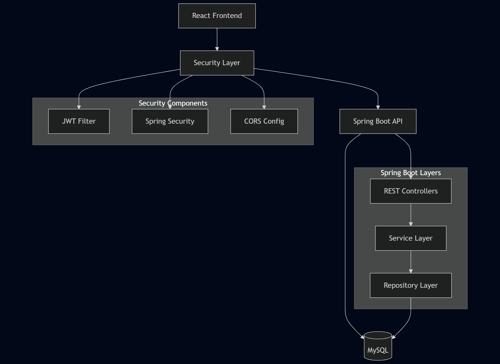
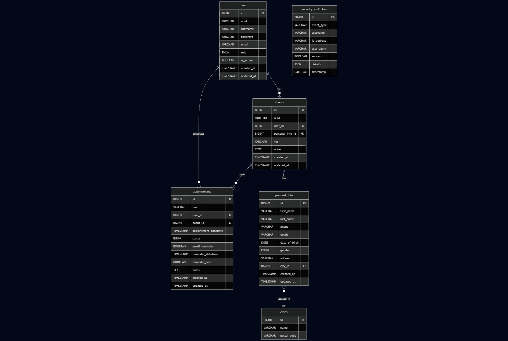
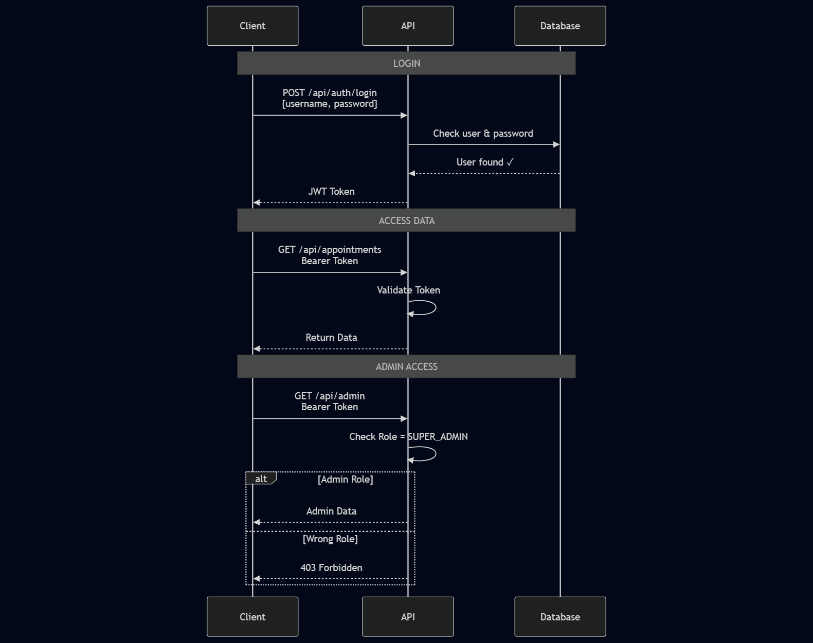
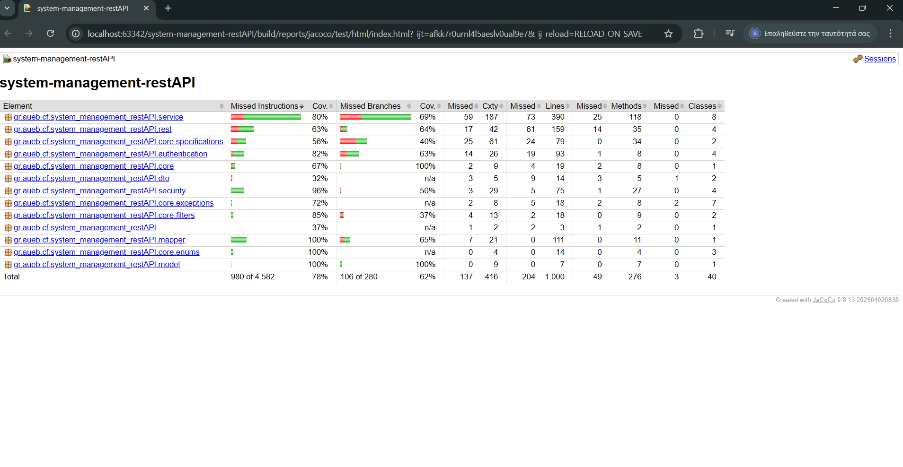
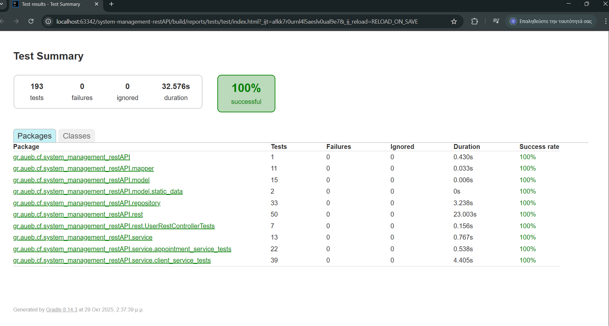

# System Management REST API


A **production-grade Spring Boot REST API** for client and appointment management, featuring **secure JWT authentication**, **role-based authorization**, and **advanced filtering capabilities**.  

Designed and implemented as the **Capstone Project** for the [Coding Factory, Athens University of Economics and Business (AUEB)](https://codingfactory.aueb.gr/).  

🧠 Built with a **clean, modular architecture**, **193 automated tests** (unit + integration) reaching **78% coverage**, and full **Swagger/OpenAPI documentation** — ensuring **reliability, maintainability, and scalability** for real-world deployment.


[](https://github.com/grgks/system-management-RestAPI/releases/tag/v1.0.0)

---
## 📋 Table of Contents
- [Live Production](#-live-production)
- [Screenshots](#-screenshots)
- [Features](#-features)
- [Tech Stack](#️-tech-stack)
- [Prerequisites](#-prerequisites)
- [Architecture Diagrams](#️-architecture-diagrams)
- [Quick Start](#-quick-start)
- [API Documentation](#-api-documentation)
- [Authentication](#-authentication)
- [Project Structure](#️-project-structure)
- [Testing](#-testing)
- [Configuration](#️-configuration)
- [Security Audit System](#️-security-audit-system)
- [Notes](#-notes)
- [Docker Deployment](#-docker-deployment)
- [Production Deployment](#️-production-deployment)
- [CI/CD & Security](#-cicd--security)
- [Privacy & Data Handling](#-privacy--data-handling)
- [License](#-license)
- [Acknowledgments](#-acknowledgments)

## 🌐 Live Production

**Production API:** https://system-management-restapi.onrender.com

**Live Documentation:** https://system-management-restapi.onrender.com/swagger-ui.html

⚠️ **Note:** First request may take 30-60 seconds (cold start on free tier)
---
 - 👉 A complete React-based frontend that integrates with this API can be found here:  
[WorkApp Frontend](https://github.com/grgks/appointment-system-react)
---
## 📸 Screenshots
**Swagger**
<table border="0" cellpadding="0" cellspacing="0">
<tr>
<td></td>
<td></td>
<td></td>
<td></td>
</tr>
</table>

**Postman**
<table border="0" cellpadding="0" cellspacing="0">
<tr>
<td></td>
<td></td>
<td></td>
<td></td>
<td></td>
<td></td>
<td></td>
<td></td>
</tr>
</table>

---
### 🎥**Video Tutorial:** [⬇️ Swagger API Demonstration](https://github.com/grgks/system-management-RestAPI/releases/tag/v1.0.0) (50.8MB .mp4)
- Available under **Assets** --> **Download**
- Complete walkthrough of API endpoints
---


## 🚀 Features

### 🔐 **Security & Authentication**
- **JWT Token-based Authentication**
- **Role-based Authorization** (CLIENT, PATIENT, SUPER_ADMIN)
- **BCrypt Password Hashing**
- **CORS Configuration** for cross-origin requests
- **Custom Security Handlers** for unauthorized access

### 👥 **User & Client Management**
- **Complete User CRUD Operations**
- **Client Registration & Management**
- **Personal Information Handling**
- **Role-based Access Control**
- **User Activity Tracking**

### 📅 **Appointment System**
- **Appointment Scheduling & Management**
- **Status Tracking** (PENDING, COMPLETED, CANCELLED)
- **Email Reminder System** (Pending)
- **Date Range Filtering**
- **User & Client Association**

### 🔍 **Advanced Filtering & Search**
- **JPA Specifications** for dynamic queries
- **Pagination & Sorting** on all endpoints
- **Custom Filters** for Appointments and Clients
- **Full-text Search** capabilities

### 🛡️ **Security Audit System**
- **Authentication Event Logging** - Track all login attempts, token validations
- **CRUD Operation Auditing** - Monitor all create/update/delete operations
- **Security Dashboard** - Real-time security metrics and event monitoring
- **Security Metrics API** - 24-hour statistics, success rates, suspicious IPs
- **Event Types Tracking**:
  

### 🏗️ **Scalable Architecture**
- **Role-based Design** ready for extension (CLIENT, PATIENT, SUPER_ADMIN)
- **PATIENT role** implemented to demonstrate scalability potential
- **Modular Structure** - new entities can be added without refactoring
- **Clean Architecture** - Repository pattern with business logic in Service layer
- **EntityManager Integration** - optimized queries with JOIN FETCH for performance
- **Comprehensive Validation** - business rules enforcement at service level 
- **Clean separation** of Controllers, Services, Repositories per entity
- **Future-proof design** for easy horizontal expansion

### 📚 **API Documentation**
- **OpenAPI 3.0** integration
- **Swagger UI** for interactive testing
- **Comprehensive endpoint documentation**
- **Request/Response examples**

## 🛠️ Tech Stack

- **Backend**: Spring Boot 3.4.7
- **Security**: Spring Security + JWT
- **Database**: MySQL 8.0
- **ORM**: Spring Data JPA + Hibernate **with EntityManager for complex queries**
- **Validation**: Bean Validation  **+ Custom Business Validation**
- **Documentation**: OpenAPI 3.0 + Swagger UI
- **Build Tool**: Gradle
- **Java Version**: 17 (Amazon Corretto)
- **Architecture**: **Clean layered architecture** with optimal performance
  
## 📋 Prerequisites

- **Java 17** or higher
- **MySQL 8.0** or higher
- **Gradle 7.0** or higher
- **Git**
  
---
## 🏗️ Architecture Diagrams
*Complete system overview showing layered architecture, database relationships, and security flow*
<table border="0" cellpadding="0" cellspacing="0">
<tr>
<td align="center">
  <h4>System Architecture</h4>
  
</td>
<td align="center">
  <h4>Database Schema Diagram</h4>
  
</td>
<td align="center">
  <h4>JWT Authentication Flow</h4>
  
</td>
</tr>
</table>


**Authentication Flow Steps:**
```
Login → Client sends credentials → API validates → Returns JWT token
Access → Client sends Bearer token → API validates → Returns protected data  
Authorization → Role-based access control (CLIENT/PATIENT/SUPER_ADMIN)
```
## ⚡ Quick Start

### 1. Clone the Repository
```bash
git clone https://github.com/grgks/system-management-RestAPI.git
cd system-management-RestAPI
```

### 2. Database Setup
```sql
CREATE DATABASE appointment_system_restdb;
CREATE USER 'your_username'@'localhost' IDENTIFIED BY 'your_password';
GRANT ALL PRIVILEGES ON appointment_system_restdb.* TO 'your_username'@'localhost';
FLUSH PRIVILEGES;
```

### 3. Environment Configuration

#### Option A: Windows System Environment Variables (Recommended)
1. **Right-click "This PC"** → Properties → Advanced System Settings
2. **Click "Environment Variables"**
3. **Under "System Variables"**, click "New" and add:
   ```
   Variable Name: DB_USERNAME
   Variable Value: your_username
   
   Variable Name: DB_PASSWORD
   Variable Value: your_password
   
   Variable Name: JWT_SECRET
   Variable Value: your_jwt_secret_key_here
   ```
4. **Click OK** and restart your IDE

#### Option B: Windows Command Line (Alternative)
```cmd
setx DB_USERNAME "your_username"
setx DB_PASSWORD "your_password"
setx JWT_SECRET "your_jwt_secret_key_here"
```

#### Option C: Linux/Mac
```bash
export DB_USERNAME=your_username
export DB_PASSWORD=your_password
export JWT_SECRET=your_jwt_secret_key_here
```

### 4. Build & Run
```bash
# Build the project
./gradlew build

# Run the application
./gradlew bootRun
```

The application will start on `http://localhost:8080`

## 📖 API Documentation

Once the application is running, access the **interactive API documentation**:

- **🎯 Swagger UI**: `http://localhost:8080/swagger-ui.html`
- **📋 OpenAPI JSON**: `http://localhost:8080/v3/api-docs`

**The Swagger UI provides:**
- ✅ **Complete endpoint documentation** with request/response examples
- ✅ **Interactive API testing** directly from the browser  
- ✅ **Authentication integration** - add your JWT token once, test all endpoints
- ✅ **Request/Response schemas** with validation rules
- ✅ **Real-time API exploration** without external tools

### 🔑 How to Use Swagger for Testing

1. **Start the application** (`./gradlew bootRun`)
2. **Open Swagger UI** in your browser: `http://localhost:8080/swagger-ui.html`
3. **Register a new client** using the `/api/clients/save` endpoint (no auth required)
4. **Authenticate** using `/api/auth/authenticate` to get your JWT token
5. **Click "Authorize" button** in Swagger UI and enter: `Bearer <your_jwt_token>`
6. **Test any endpoint** with full authentication and validation

> **💡 Pro Tip**: All endpoint documentation, request examples, response schemas, and validation rules are available in the interactive Swagger interface!
---

### Create Admin User
After first application run, manually insert admin user in MySQL Workbench:
```sql
INSERT INTO users (username, password, email, role, uuid, created_at, updated_at, is_active) 
VALUES (
   'superadmin',
   '$2a$11$nP94HRe5lXjg3iNUr.rE6epdJuIG.mEvttr9443eosuAQid1IMGxi',
   'admin@example.com',
   'SUPER_ADMIN',
   'admin-uuid-12345',
   NOW(),
   NOW(),
   true
);

> **Note:** To use a different password, generate a BCrypt hash with **rounds/cost factor 11** and replace the hash in the SQL above.
```
## 🔑 Authentication
```
Login Credentials:

Username: superadmin
Password: Password123!!
```
### Postman ➡️ Body ➡️ raw ➡️ Json
```
{
  "username": "superadmin",
  "password": "Password123!!"
}
```
### Use the Token
```bash
Authorization: Bearer <your_jwt_token>        ➡️ Ready to navigate with privilliges
```
---

### 1. Register a New Client
```bash
POST http://localhost:8080/api/clients/save
Content-Type: application/json

{
  "isActive": true,
  "user": {
    "isActive": true,
    "username": "JohnDoe",
    "password": "Password123!",
    "email": "john@gmail.com",
    "role": "CLIENT"
  },
  "personalInfo": {
    "firstName": "John",
    "lastName": "Johnas",
    "email": "john.personal@example.com",
    "phone": "5132875731",
    "dateOfBirth": "2025-07-23",
    "gender": "MALE",
    "address": "string",
    "cityId": 1
  },
  "vat": "5356608968",
  "notes": "string"
}
```

### 2. Authenticate
```bash
POST http://localhost:8080/api/auth/authenticate
Content-Type: application/json

{
  "username": "JohnDoe",
  "password": "Password123!"
}
```

### 3. Use the Token
```bash
Authorization: Bearer <your_jwt_token>
```

### 4. Enjoy surfing
---

## 📝 Key API Endpoints

**For complete API documentation with request/response examples, visit the Swagger UI at `http://localhost:8080/swagger-ui.html`**

## 🏗️ Project Structure

```
src/main/java/gr/aueb/cf/system_management_restAPI/
├── authentication/          # JWT & Authentication logic
├── core/
│   ├── enums/              # Application enums
│   ├── exceptions/         # Custom exceptions
│   ├── filters/            # Request filters & pagination
│   └── specifications/     # JPA Specifications
├── dto/                    # Data Transfer Objects
├── mapper/                 # Entity ↔ DTO mapping
├── model/                  # JPA Entities
├── repository/             # Data Access Layer
├── rest/                   # REST Controllers
├── security/               # Security configuration
└── service/                # Business Logic Layer
```

## 🧪 Testing

### Test Coverage


This project includes a comprehensive test suite with **193 tests** achieving **78% code coverage**.

<table border="0" cellpadding="0" cellspacing="0">
<tr>
<td align="center">
  <h4>Jacoco</h4>
  
</td>
<td align="center">
  <h4>Summary Test</h4>
  
</td>
</tr>
</table>

### 🟢 Test Categories

| Category | Count | Coverage | Description |
|----------|-------|----------|-------------|
| **Unit Tests** | 71 | 85% | Service layer business logic |
| **Integration Tests** | 122 | 75% | REST Controllers & Repositories |
| **Authorization Tests** | 42 | 90% | Role-based access control |
| **Total** | **193** | **78%** | **Complete test coverage** |

### 🟢 Running Tests

####  Run All Tests
```bash
./gradlew test
```

#### Run Tests with Coverage Report
```bash
./gradlew clean test jacocoTestReport
```

#### View Coverage Report
```bash
# The report will be generated at:
open build/reports/jacoco/test/html/index.html
```

#### Run Specific Test Classes
```bash
# Single test class
./gradlew test --tests "AppointmentServiceTest"

# Test package
./gradlew test --tests "gr.aueb.cf.system_management_restAPI.service.*"
```

#### 🟢 Test Infrastructure

#### Multiple Database Environments
- **Development DB**: `appointment_system_restdb` (main application)
- **Test DB**: `appointment_system_restdb_test` (automated tests)
- **Production DB**: `appointment_system_restdb_prod` (production ready)

#### 🟢 Safety Features
The test suite includes a **safety check** to prevent accidental data deletion:
```java
// TestDBHelper.java
public static void eraseData(DataSource dataSource) throws SQLException {
    String dbName = connection.getCatalog();
    
    // Safety check: MUST be test database
    if (!dbName.contains("_test")) {
        throw new IllegalStateException(
            "🚨 SAFETY CHECK FAILED! Cannot erase non-test database: " + dbName
        );
    }
    // Proceed with cleanup...
}
```

This ensures tests **never** accidentally delete production data.

### 🟢 Test Configuration

Tests use a separate configuration file:
```properties
# src/test/resources/application.properties
spring.datasource.url=jdbc:mysql://localhost:3306/appointment_system_restdb_test
spring.jpa.hibernate.ddl-auto=update
```

### 🟢 Key Test Examples

#### 🟢 Service Layer Test
```java
@Test
void testGetAppointmentById_Success() {
    // Given
    Appointment appointment = createTestAppointment();
    when(appointmentRepository.findById(1L)).thenReturn(Optional.of(appointment));
    
    // When
    AppointmentReadOnlyDTO result = appointmentService.getAppointmentById(1L);
    
    // Then
    assertNotNull(result);
    assertEquals(appointment.getId(), result.getId());
    verify(appointmentRepository, times(1)).findById(1L);
}
```

#### 🟢 Authorization Test
```java
@Test
void testGetAppointment_AsClient_OwnAppointment_Success() {
    // CLIENT can view their own appointment
    authenticateAs("client1", Role.CLIENT);
    
    Appointment appointment = createAppointmentFor("client1");
    AppointmentReadOnlyDTO result = appointmentService.getAppointmentById(appointment.getId());
    
    assertNotNull(result);
}

@Test
void testGetAppointment_AsClient_OtherAppointment_ThrowsAccessDenied() {
    // CLIENT cannot view other's appointment
    authenticateAs("client1", Role.CLIENT);
    
    Appointment otherAppointment = createAppointmentFor("client2");
    
    assertThrows(AccessDeniedException.class, () -> {
        appointmentService.getAppointmentById(otherAppointment.getId());
    });
}
```

#### 🟢 REST Controller Integration Test
```java
@Test
void testCreateAppointment_Authenticated_ReturnsCreated() throws Exception {
    String token = getAuthToken("superadmin", "Password123!!");
    
    mockMvc.perform(post("/api/appointments/save")
            .header("Authorization", "Bearer " + token)
            .contentType(MediaType.APPLICATION_JSON)
            .content(appointmentJson))
            .andExpect(status().isCreated())
            .andExpect(jsonPath("$.id").exists());
}
```

### 🟢 Test Reports

After running tests, view detailed reports:

#### 🟢 Coverage Report
- **Location**: `build/reports/jacoco/test/html/index.html`
- **Metrics**: Line coverage, Branch coverage, Method coverage
- **Breakdown**: Per package, class, and method

#### 🟢 Test Report
- **Location**: `build/reports/tests/test/index.html`
- **Details**: Test execution time, success/failure rates
- **Organization**: By package and class

### 🟢 Coverage by Package

| Package | Line Coverage | Branch Coverage |
|---------|--------------|-----------------|
| service | 85% | 80% |
| rest | 75% | 70% |
| repository | 70% | 65% |
| mapper | 90% | 85% |
| security | 80% | 75% |
| **Overall** | **78%** | **73%** |

---


## 🔧 Configuration

### Database Configuration
```properties
spring.datasource.url=jdbc:mysql://localhost:3306/appointment_system_restdb
spring.datasource.username=${DB_USERNAME}
spring.datasource.password=${DB_PASSWORD}
spring.jpa.hibernate.ddl-auto=update
```

### JWT Configuration
```properties
jwt.secret=${JWT_SECRET}
jwt.expiration=7200000  # 2 hours
```
---
## 🛡️ Security Audit System

### Overview
Comprehensive security monitoring system tracking authentication events and CRUD operations.

### Components

#### SecurityAuditService
Handles authentication-related events:
- Login success/failure
- Token validation errors
- Authorization failures

#### SecurityCrudAuditService
Tracks all data modifications:
- User management operations
- Client CRUD operations
- Appointment lifecycle events

### Audit Log Structure
```java
{
  "id": 1,
  "eventType": "LOGIN_SUCCESS",
  "username": "john.doe",
  "ipAddress": "192.168.1.100",
  "userAgent": "Mozilla/5.0...",
  "success": true,
  "timestamp": "2025-01-15T10:30:00",
  "details": {
    "userId": 123,
    "action": "User logged in"
  }
}
```

### Security Endpoints

#### Get Security Events
```http
GET /api/admin/security/events?limit=50
Authorization: Bearer {admin_token}

Response: Array of SecurityEvent objects
```

#### Get Security Metrics
```http
GET /api/admin/security/metrics
Authorization: Bearer {admin_token}

Response:
{
  "totalEvents": 1250,
  "failedLoginsLast24h": 5,
  "successfulLoginsLast24h": 45,
  "tokenErrorsLast24h": 2,
  "authorizationFailuresLast24h": 1,
  "successRate": 90.0,
  "suspiciousIPs": ["192.168.1.150"],
  "recentFailures": [...]
}
```

### Event Types Reference

| Category | Event Type | Description |
|----------|-----------|-------------|
| **Auth** | LOGIN_SUCCESS | Successful user login |
| **Auth** | LOGIN_FAILED | Failed login attempt |
| **Auth** | TOKEN_EXPIRED | JWT token expired |
| **Auth** | TOKEN_INVALID | Invalid JWT token |
| **Auth** | AUTHORIZATION_FAILED | Insufficient permissions |
| **User** | USER_CREATED | New user created by admin |
| **User** | USER_UPDATED | User information modified |
| **User** | USER_DELETED | User removed from system |
| **Client** | CLIENT_CREATED | New client registered |
| **Client** | CLIENT_UPDATED | Client information modified |
| **Client** | CLIENT_DELETED | Client removed from system |
| **Appointment** | APPOINTMENT_CREATED | New appointment scheduled |
| **Appointment** | APPOINTMENT_UPDATED | Appointment modified |
| **Appointment** | APPOINTMENT_DELETED | Appointment cancelled |
---

## 📝 Notes
> ℹ️ This is a production-ready REST API with comprehensive testing (193 tests, 78% coverage), complete Swagger documentation, and role-based authorization.
>
> **Implemented Features:**
> - ✅ Docker containerization with multi-stage builds
> - ✅ CI/CD pipeline with automated builds and security scanning
> - ✅ Production-ready deployment with Docker Compose
> - ✅ Security audit dashboard with real-time monitoring and analytics
>   
> **Future enhancements may include:**
> - 📧 Email notification system for appointment reminders
> - 🔔 Real-time push notifications (WebSocket)
---

## 🐳 Docker Deployment

This API is containerized and available as a Docker image for easy deployment.

### Docker Hub

**Image:** [grgks/workapp-backend:latest](https://hub.docker.com/r/grgks/workapp-backend)
- **Size:** 384MB (123MB compressed)
- **Base:** eclipse-temurin:17-jre-alpine
- **Multi-stage build:** Optimized for production
- **Health checks:** Built-in readiness probes

### Quick Docker Run
```bash
# Pull the image
docker pull grgks/workapp-backend:latest

# Run with environment variables
docker run -d \
  --name workapp-backend \
  -p 8080:8080 \
  -e DB_NAME=appointment_system_restdb \
  -e DB_USERNAME=your_username \
  -e DB_PASSWORD=your_password \
  -e JWT_SECRET=your_jwt_secret \
  grgks/workapp-backend:latest
```

### Build Your Own Image
```bash
# Build from source
docker build -t workapp-backend .

# Run locally built image
docker run -p 8080:8080 workapp-backend
```

### Full System Deployment

For complete deployment with frontend and database:

👉 **[WorkApp Deployment Repository](https://github.com/grgks/workapp-deployment)**
```bash
git clone https://github.com/grgks/workapp-deployment.git
cd workapp-deployment
docker-compose up -d
```

## ☁️ Production Deployment

### Render Platform

This API is deployed on **[Render](https://render.com)** using Docker containers.

**Deployment Features:**
- ✅ Automated deployments from GitHub
- ✅ Docker-based deployment
- ✅ Environment variables management
- ✅ Automatic HTTPS
- ✅ Health checks and monitoring

**Production URL:** https://system-management-restapi.onrender.com

**Connected Frontend:** https://appointment-system-react-one.vercel.app

### Environment Configuration

Production environment uses the following configuration:
- **Database:** MySQL 8.0
- **CORS:** Configured for Vercel frontend
- **JWT:** Production secret key
- **Port:** 8080

**Note:** Cold starts may occur on free tier (30-60s first request)

## 🔄 CI/CD & Security

### Automated Pipeline

Every push to `main` triggers:
- ✅ Automated Docker build
- ✅ Security vulnerability scanning (Trivy)
- ✅ Push to Docker Hub
- ✅ GitHub Security alerts

**Workflow:** [GitHub Actions](.github/workflows/docker-build-push.yml)

### Security Scanning

All Docker images are automatically scanned:
- **Scanner:** Trivy + Docker Scout
- **Reports:** [Security tab](https://github.com/grgks/system-management-restAPI/security)
- **Status:** 9 known vulnerabilities (monitored, fixes available)

---

## 🔒 Privacy & Data Handling

> **Important:** This is a demonstration/portfolio project designed to showcase security monitoring capabilities. It is not intended for production use with real user data.

This API logs the following data strictly for security and operational demonstration purposes:
- IP addresses (client identification and security monitoring)
- User-Agent strings (browser/device information)
- Authentication events (login attempts, token lifecycle)
- User actions (CRUD operations for audit trail)

**Purpose:** 
- Security monitoring and threat detection
- Fraud prevention and abuse mitigation
- Audit logging for compliance requirements
- System debugging and troubleshooting

**Data Retention:** 
- Security audit logs are retained for up to 90 days
- Automatic cleanup policies can be configured

**Access Control:** 
- All security endpoints restricted to SUPER_ADMIN role only
- API authentication required via JWT tokens
- Role-based authorization enforced at service layer

**Technical Implementation:**
- IP extraction with proxy/load balancer support (X-Forwarded-For headers)
- No PII tracking beyond operational requirements
- No user profiling, behavioral analytics, or marketing tracking
- Audit logs stored in dedicated database table with indexed queries

**Compliance Notes:**
For production deployments, ensure:
- Comprehensive Privacy Policy implementation
- GDPR compliance for EU users
- Data subject access request (DSAR) endpoints
- Appropriate data retention and deletion policies
- Secure log archival procedures

**Security Best Practices:**
- Never log sensitive data (passwords, payment info, SSNs)
- Use parameterized queries to prevent SQL injection in audit logs
- Implement rate limiting on security endpoints
- Regular security audits and penetration testing recommended

---

## 📄 License

This project is licensed under the MIT License - see the [LICENSE](LICENSE) file for details.

## 👤 Author

**grgks**
- GitHub: [@grgks](https://github.com/grgks)

## 🙏 Acknowledgments

- **[CodingFactory AUEB](https://codingfactory.aueb.gr/)** for providing comprehensive training in Java/Spring Boot development and modern web technologies that inspired this REST API project as part of my capstone project
- Spring Boot community for excellent documentation
- All contributors who help improve this project
- Open source libraries that make this project possible

---

⭐ **If you find this project helpful, please give it a star!** ⭐
