# System Management REST API


A comprehensive **Spring Boot REST API** for managing client appointments and user administration with **JWT authentication**, **role-based authorization**, and **advanced filtering capabilities**.

## 📸 Screenshots
**Swagger**
<table border="0" cellpadding="0" cellspacing="0">
<tr>
<td>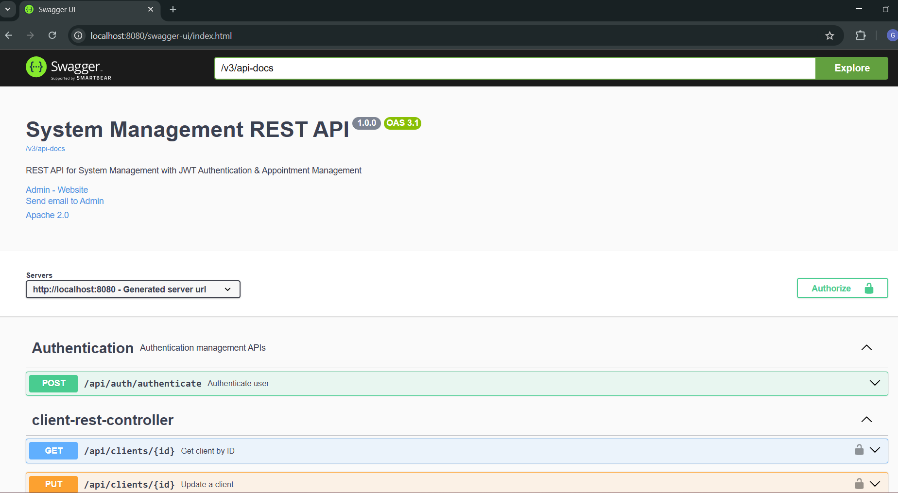</td>
<td>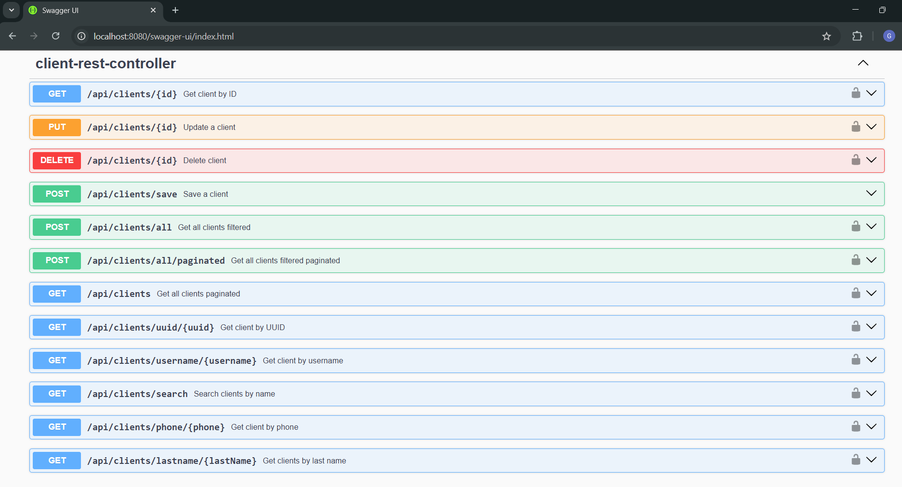</td>
<td>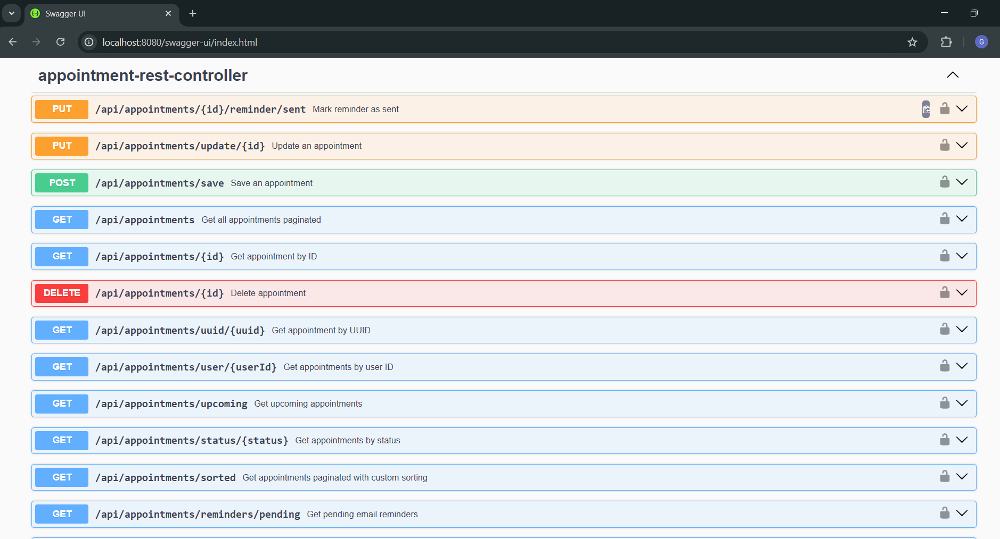</td>
<td>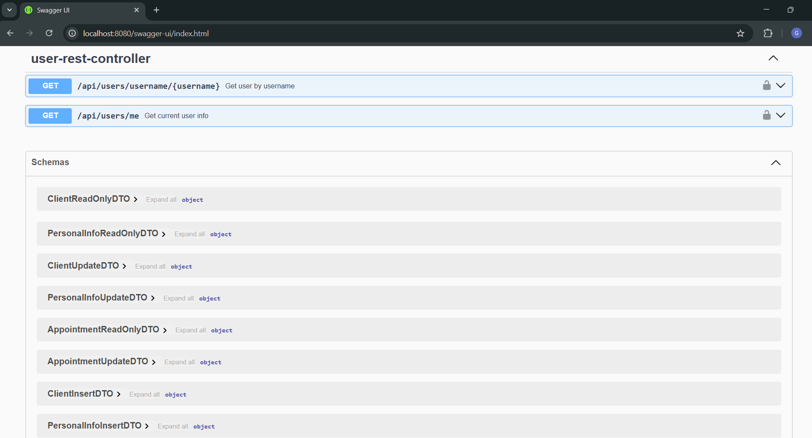</td>
</tr>
</table>

**Postman**
<table border="0" cellpadding="0" cellspacing="0">
<tr>
<td>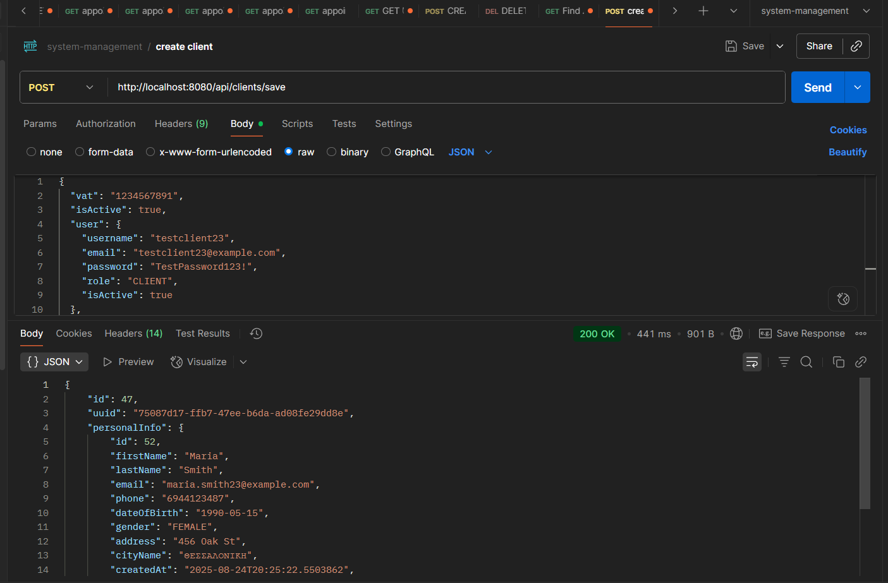</td>
<td>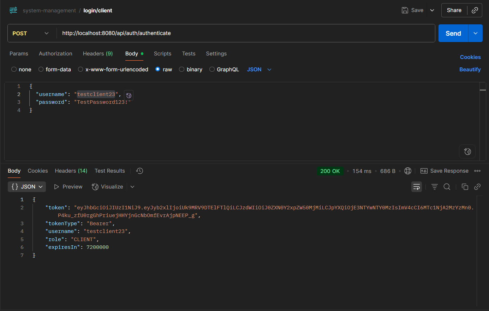</td>
<td>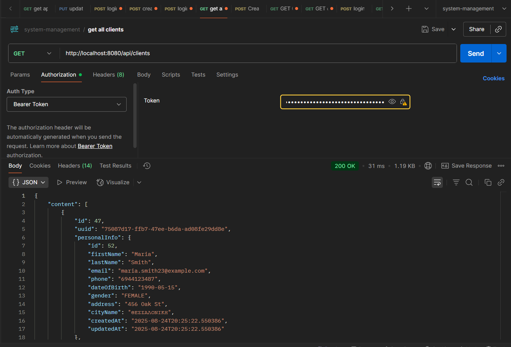</td>
<td>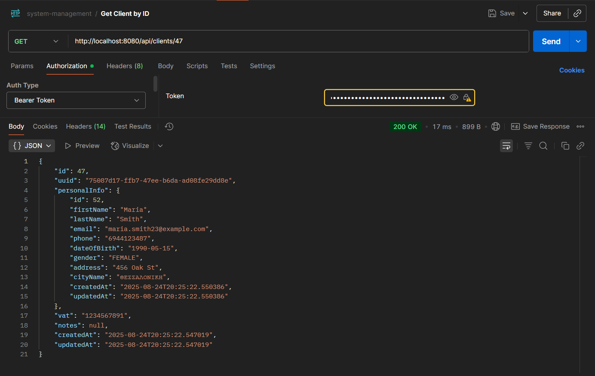</td>
<td>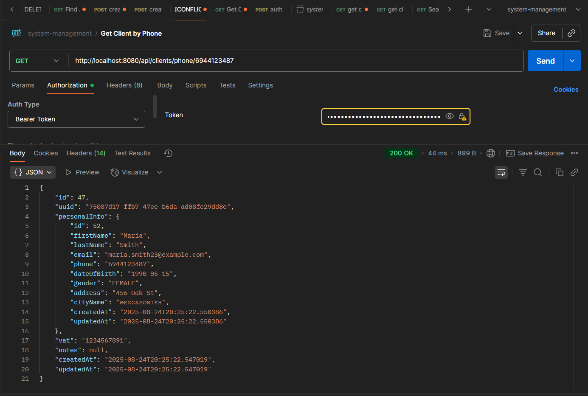</td>
<td>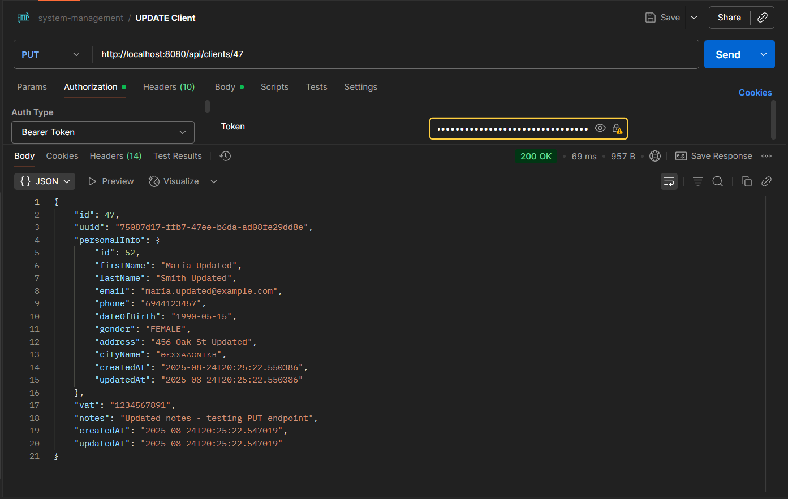</td>
<td>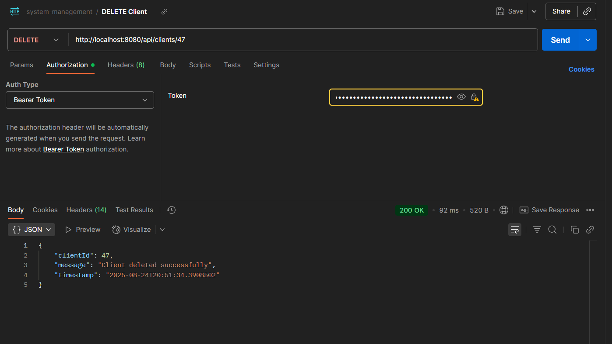</td>
<td>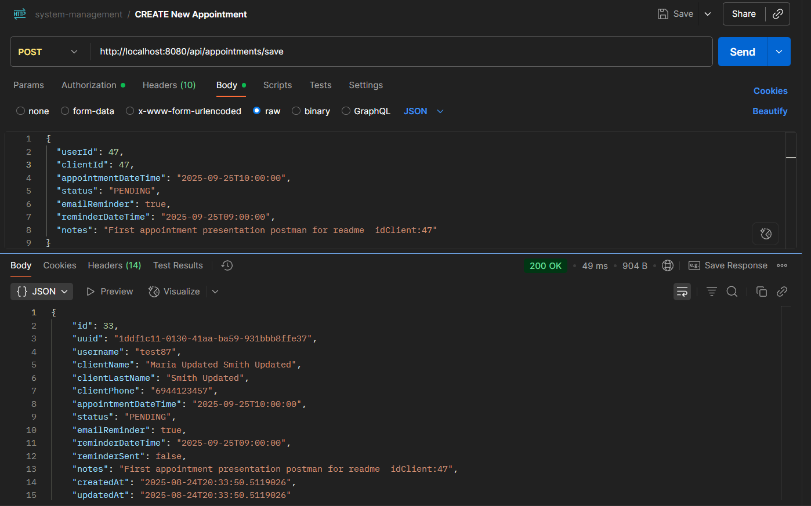</td>
</tr>
</table>

---
### 🎥**Video Tutorial:** [⬇️ Swagger API Demonstration](https://github.com/grgks/system-management-RestAPI/releases/tag/v1.0.0) (50.8MB .mp4)
- Available under **Assets** --> **Download**
- Complete walkthrough of API endpoints
---


## 🚀 Features

### 🔐 **Security & Authentication**
- **JWT Token-based Authentication**
- **Role-based Authorization** (CLIENT, PATIENT, SUPER_ADMIN)
- **BCrypt Password Hashing**
- **CORS Configuration** for cross-origin requests
- **Custom Security Handlers** for unauthorized access

### 👥 **User & Client Management**
- **Complete User CRUD Operations**
- **Client Registration & Management**
- **Personal Information Handling**
- **Role-based Access Control**
- **User Activity Tracking**

### 📅 **Appointment System**
- **Appointment Scheduling & Management**
- **Status Tracking** (PENDING, COMPLETED, CANCELLED)
- **Email Reminder System** (Pending)
- **Date Range Filtering**
- **User & Client Association**

### 🔍 **Advanced Filtering & Search**
- **JPA Specifications** for dynamic queries
- **Pagination & Sorting** on all endpoints
- **Custom Filters** for Appointments and Clients
- **Full-text Search** capabilities

### 🏗️ **Scalable Architecture**
- **Role-based Design** ready for extension (CLIENT, PATIENT, SUPER_ADMIN)
- **PATIENT role** implemented to demonstrate scalability potential
- **Modular Structure** - new entities can be added without refactoring
- **Clean Architecture** - Repository pattern with business logic in Service layer
- **EntityManager Integration** - optimized queries with JOIN FETCH for performance
- **Comprehensive Validation** - business rules enforcement at service level 
- **Clean separation** of Controllers, Services, Repositories per entity
- **Future-proof design** for easy horizontal expansion

### 📚 **API Documentation**
- **OpenAPI 3.0** integration
- **Swagger UI** for interactive testing
- **Comprehensive endpoint documentation**
- **Request/Response examples**

## 🛠️ Tech Stack

- **Backend**: Spring Boot 3.4.7
- **Security**: Spring Security + JWT
- **Database**: MySQL 8.0
- **ORM**: Spring Data JPA + Hibernate **with EntityManager for complex queries**
- **Validation**: Bean Validation  **+ Custom Business Validation**
- **Documentation**: OpenAPI 3.0 + Swagger UI
- **Build Tool**: Gradle
- **Java Version**: 17 (Amazon Corretto)
- **Architecture**: **Clean layered architecture** with optimal performance
  
## 📋 Prerequisites

- **Java 17** or higher
- **MySQL 8.0** or higher
- **Gradle 7.0** or higher
- **Git**

## ⚡ Quick Start

### 1. Clone the Repository
```bash
git clone https://github.com/grgks/system-management-RestAPI.git
cd system-management-RestAPI
```

### 2. Database Setup
```sql
CREATE DATABASE appointment_system_restdb;
CREATE USER 'your_username'@'localhost' IDENTIFIED BY 'your_password';
GRANT ALL PRIVILEGES ON appointment_system_restdb.* TO 'your_username'@'localhost';
FLUSH PRIVILEGES;
```

### 3. Environment Configuration

#### Option A: Windows System Environment Variables (Recommended)
1. **Right-click "This PC"** → Properties → Advanced System Settings
2. **Click "Environment Variables"**
3. **Under "System Variables"**, click "New" and add:
   ```
   Variable Name: DB_USERNAME
   Variable Value: your_username
   
   Variable Name: DB_PASSWORD
   Variable Value: your_password
   
   Variable Name: JWT_SECRET
   Variable Value: your_jwt_secret_key_here_minimum_256_bits
   ```
4. **Click OK** and restart your IDE

#### Option B: Windows Command Line (Alternative)
```cmd
setx DB_USERNAME "your_username"
setx DB_PASSWORD "your_password"
setx JWT_SECRET "your_jwt_secret_key_here_minimum_256_bits"
```

#### Option C: Linux/Mac
```bash
export DB_USERNAME=your_username
export DB_PASSWORD=your_password
export JWT_SECRET=your_jwt_secret_key_here_minimum_256_bits
```

### 4. Build & Run
```bash
# Build the project
./gradlew build

# Run the application
./gradlew bootRun
```

The application will start on `http://localhost:8080`

## 📖 API Documentation

Once the application is running, access the **interactive API documentation**:

- **🎯 Swagger UI**: `http://localhost:8080/swagger-ui.html`
- **📋 OpenAPI JSON**: `http://localhost:8080/v3/api-docs`

**The Swagger UI provides:**
- ✅ **Complete endpoint documentation** with request/response examples
- ✅ **Interactive API testing** directly from the browser  
- ✅ **Authentication integration** - add your JWT token once, test all endpoints
- ✅ **Request/Response schemas** with validation rules
- ✅ **Real-time API exploration** without external tools

### 🔑 How to Use Swagger for Testing

1. **Start the application** (`./gradlew bootRun`)
2. **Open Swagger UI** in your browser: `http://localhost:8080/swagger-ui.html`
3. **Register a new client** using the `/api/clients/save` endpoint (no auth required)
4. **Authenticate** using `/api/auth/authenticate` to get your JWT token
5. **Click "Authorize" button** in Swagger UI and enter: `Bearer <your_jwt_token>`
6. **Test any endpoint** with full authentication and validation

> **💡 Pro Tip**: All endpoint documentation, request examples, response schemas, and validation rules are available in the interactive Swagger interface!
---

### Create Admin User to MySQL Workbench after first deploy manually
```sql
INSERT INTO users (username, password, email, role, uuid, created_at, updated_at, is_active) 
VALUES (
   'superadmin',
   '$2a$11$N9qo8uLOickgx2ZMRZoMye.Ub8IYn2J4v0/KK5vQGpzjvl5kR.CrC(hash your own)',
   'admin@example.com',
   'SUPER_ADMIN',
   'admin-uuid-12345',
   NOW(),
   NOW(),
   true
);
```

### POST /api/auth/authenticate

```
{
  "username": "superadmin",
  "password": "passworD234@(hash your own)"
}
```

## 🔑 Authentication

### 1. Register a New Client
```bash
POST http://localhost:8080/api/clients/save
Content-Type: application/json

{
  "isActive": true,
  "user": {
    "isActive": true,
    "username": "JohnDoe",
    "password": "Password123!",
    "email": "john@gmail.com",
    "role": "CLIENT"
  },
  "personalInfo": {
    "firstName": "John",
    "lastName": "Johnas",
    "email": "john.personal@example.com",
    "phone": "5132875731",
    "dateOfBirth": "2025-07-23",
    "gender": "MALE",
    "address": "string",
    "cityId": 1
  },
  "vat": "5356608968",
  "notes": "string"
}
```

### 2. Authenticate
```bash
POST http://localhost:8080/api/auth/authenticate
Content-Type: application/json

{
  "username": "JohnDoe",
  "password": "Password123!"
}
```

### 3. Use the Token
```bash
Authorization: Bearer <your_jwt_token>
```

### 5. Enjoy surfing
---

## 📝 Key API Endpoints

**For complete API documentation with request/response examples, visit the Swagger UI at `http://localhost:8080/swagger-ui.html`**

## 🏗️ Project Structure

```
src/main/java/gr/aueb/cf/system_management_restAPI/
├── authentication/          # JWT & Authentication logic
├── core/
│   ├── enums/              # Application enums
│   ├── exceptions/         # Custom exceptions
│   ├── filters/            # Request filters & pagination
│   └── specifications/     # JPA Specifications
├── dto/                    # Data Transfer Objects
├── mapper/                 # Entity ↔ DTO mapping
├── model/                  # JPA Entities
├── repository/             # Data Access Layer
├── rest/                   # REST Controllers
├── security/               # Security configuration
└── service/                # Business Logic Layer
```

## 🔧 Configuration

### Database Configuration
```properties
spring.datasource.url=jdbc:mysql://localhost:3306/appointment_system_restdb
spring.datasource.username=${DB_USERNAME}
spring.datasource.password=${DB_PASSWORD}
spring.jpa.hibernate.ddl-auto=update
```

### JWT Configuration
```properties
jwt.secret=${JWT_SECRET}
jwt.expiration=7200000  # 2 hours
```

## 📄 License

This project is licensed under the MIT License - see the [LICENSE](LICENSE) file for details.

## 👤 Author

**grgks**
- GitHub: [@grgks](https://github.com/grgks)

## 🙏 Acknowledgments

- **[CodingFactory AUEB](https://codingfactory.aueb.gr/)** for providing comprehensive training in Java/Spring Boot development and modern web technologies that inspired this REST API project as part of my capstone project
- Spring Boot community for excellent documentation
- All contributors who help improve this project
- Open source libraries that make this project possible

---

⭐ **If you find this project helpful, please give it a star!** ⭐
