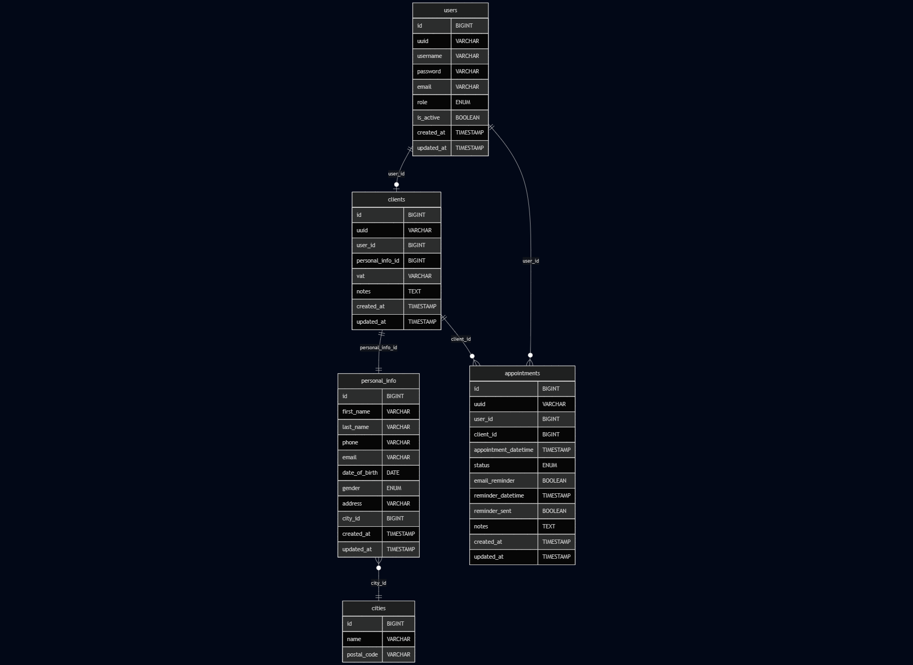

# System Management REST API


A **production-grade Spring Boot REST API** for client and appointment management, featuring **secure JWT authentication**, **role-based authorization**, and **advanced filtering capabilities**.  

Designed and implemented as the **Capstone Project** for the [Coding Factory, Athens University of Economics and Business (AUEB)](https://codingfactory.aueb.gr/).  

🧠 Built with a **clean, modular architecture**, **193 automated tests** (unit + integration) reaching **78% coverage**, and full **Swagger/OpenAPI documentation** — ensuring **reliability, maintainability, and scalability** for real-world deployment.


[](https://github.com/grgks/system-management-RestAPI/releases/tag/v1.0.0)


 - 👉 A complete React-based frontend that integrates with this API can be found here:  
[WorkApp Frontend](https://github.com/grgks/appointment-system-react)
---
## 📸 Screenshots
**Swagger**
<table border="0" cellpadding="0" cellspacing="0">
<tr>
<td></td>
<td></td>
<td></td>
<td></td>
</tr>
</table>

**Postman**
<table border="0" cellpadding="0" cellspacing="0">
<tr>
<td></td>
<td></td>
<td></td>
<td></td>
<td></td>
<td></td>
<td></td>
<td></td>
</tr>
</table>

---
### 🎥**Video Tutorial:** [⬇️ Swagger API Demonstration](https://github.com/grgks/system-management-RestAPI/releases/tag/v1.0.0) (50.8MB .mp4)
- Available under **Assets** --> **Download**
- Complete walkthrough of API endpoints
---


## 🚀 Features

### 🔐 **Security & Authentication**
- **JWT Token-based Authentication**
- **Role-based Authorization** (CLIENT, PATIENT, SUPER_ADMIN)
- **BCrypt Password Hashing**
- **CORS Configuration** for cross-origin requests
- **Custom Security Handlers** for unauthorized access

### 👥 **User & Client Management**
- **Complete User CRUD Operations**
- **Client Registration & Management**
- **Personal Information Handling**
- **Role-based Access Control**
- **User Activity Tracking**

### 📅 **Appointment System**
- **Appointment Scheduling & Management**
- **Status Tracking** (PENDING, COMPLETED, CANCELLED)
- **Email Reminder System** (Pending)
- **Date Range Filtering**
- **User & Client Association**

### 🔍 **Advanced Filtering & Search**
- **JPA Specifications** for dynamic queries
- **Pagination & Sorting** on all endpoints
- **Custom Filters** for Appointments and Clients
- **Full-text Search** capabilities

### 🏗️ **Scalable Architecture**
- **Role-based Design** ready for extension (CLIENT, PATIENT, SUPER_ADMIN)
- **PATIENT role** implemented to demonstrate scalability potential
- **Modular Structure** - new entities can be added without refactoring
- **Clean Architecture** - Repository pattern with business logic in Service layer
- **EntityManager Integration** - optimized queries with JOIN FETCH for performance
- **Comprehensive Validation** - business rules enforcement at service level 
- **Clean separation** of Controllers, Services, Repositories per entity
- **Future-proof design** for easy horizontal expansion

### 📚 **API Documentation**
- **OpenAPI 3.0** integration
- **Swagger UI** for interactive testing
- **Comprehensive endpoint documentation**
- **Request/Response examples**

## 🛠️ Tech Stack

- **Backend**: Spring Boot 3.4.7
- **Security**: Spring Security + JWT
- **Database**: MySQL 8.0
- **ORM**: Spring Data JPA + Hibernate **with EntityManager for complex queries**
- **Validation**: Bean Validation  **+ Custom Business Validation**
- **Documentation**: OpenAPI 3.0 + Swagger UI
- **Build Tool**: Gradle
- **Java Version**: 17 (Amazon Corretto)
- **Architecture**: **Clean layered architecture** with optimal performance
  
## 📋 Prerequisites

- **Java 17** or higher
- **MySQL 8.0** or higher
- **Gradle 7.0** or higher
- **Git**
  
---
## 🏗️ Architecture Diagrams
*Complete system overview showing layered architecture, database relationships, and security flow*
<table border="0" cellpadding="0" cellspacing="0">
<tr>
<td align="center">
  <h4>System Architecture</h4>
  
</td>
<td align="center">
  <h4>Database Schema Diagram</h4>
  
</td>
<td align="center">
  <h4>JWT Authentication Flow</h4>
  
</td>
</tr>
</table>


**Authentication Flow Steps:**
```
Login → Client sends credentials → API validates → Returns JWT token
Access → Client sends Bearer token → API validates → Returns protected data  
Authorization → Role-based access control (CLIENT/PATIENT/SUPER_ADMIN)
```
## ⚡ Quick Start

### 1. Clone the Repository
```bash
git clone https://github.com/grgks/system-management-RestAPI.git
cd system-management-RestAPI
```

### 2. Database Setup
```sql
CREATE DATABASE appointment_system_restdb;
CREATE USER 'your_username'@'localhost' IDENTIFIED BY 'your_password';
GRANT ALL PRIVILEGES ON appointment_system_restdb.* TO 'your_username'@'localhost';
FLUSH PRIVILEGES;
```

### 3. Environment Configuration

#### Option A: Windows System Environment Variables (Recommended)
1. **Right-click "This PC"** → Properties → Advanced System Settings
2. **Click "Environment Variables"**
3. **Under "System Variables"**, click "New" and add:
   ```
   Variable Name: DB_USERNAME
   Variable Value: your_username
   
   Variable Name: DB_PASSWORD
   Variable Value: your_password
   
   Variable Name: JWT_SECRET
   Variable Value: your_jwt_secret_key_here
   ```
4. **Click OK** and restart your IDE

#### Option B: Windows Command Line (Alternative)
```cmd
setx DB_USERNAME "your_username"
setx DB_PASSWORD "your_password"
setx JWT_SECRET "your_jwt_secret_key_here"
```

#### Option C: Linux/Mac
```bash
export DB_USERNAME=your_username
export DB_PASSWORD=your_password
export JWT_SECRET=your_jwt_secret_key_here
```

### 4. Build & Run
```bash
# Build the project
./gradlew build

# Run the application
./gradlew bootRun
```

The application will start on `http://localhost:8080`

## 📖 API Documentation

Once the application is running, access the **interactive API documentation**:

- **🎯 Swagger UI**: `http://localhost:8080/swagger-ui.html`
- **📋 OpenAPI JSON**: `http://localhost:8080/v3/api-docs`

**The Swagger UI provides:**
- ✅ **Complete endpoint documentation** with request/response examples
- ✅ **Interactive API testing** directly from the browser  
- ✅ **Authentication integration** - add your JWT token once, test all endpoints
- ✅ **Request/Response schemas** with validation rules
- ✅ **Real-time API exploration** without external tools

### 🔑 How to Use Swagger for Testing

1. **Start the application** (`./gradlew bootRun`)
2. **Open Swagger UI** in your browser: `http://localhost:8080/swagger-ui.html`
3. **Register a new client** using the `/api/clients/save` endpoint (no auth required)
4. **Authenticate** using `/api/auth/authenticate` to get your JWT token
5. **Click "Authorize" button** in Swagger UI and enter: `Bearer <your_jwt_token>`
6. **Test any endpoint** with full authentication and validation

> **💡 Pro Tip**: All endpoint documentation, request examples, response schemas, and validation rules are available in the interactive Swagger interface!
---

### Create Admin User
After first application run, manually insert admin user in MySQL Workbench:
```sql
INSERT INTO users (username, password, email, role, uuid, created_at, updated_at, is_active) 
VALUES (
   'superadmin',
   '$2a$11$nP94HRe5lXjg3iNUr.rE6epdJuIG.mEvttr9443eosuAQid1IMGxi',
   'admin@example.com',
   'SUPER_ADMIN',
   'admin-uuid-12345',
   NOW(),
   NOW(),
   true
);

> **Note:** To use a different password, generate a BCrypt hash with **rounds/cost factor 11** and replace the hash in the SQL above.
```
## 🔑 Authentication
```
Login Credentials:

Username: superadmin
Password: Password123!!
```
### Postman ➡️ Body ➡️ raw ➡️ Json
```
{
  "username": "superadmin",
  "password": "Password123!!"
}
```
### Use the Token
```bash
Authorization: Bearer <your_jwt_token>        ➡️ Ready to navigate with privilliges
```
---

### 1. Register a New Client
```bash
POST http://localhost:8080/api/clients/save
Content-Type: application/json

{
  "isActive": true,
  "user": {
    "isActive": true,
    "username": "JohnDoe",
    "password": "Password123!",
    "email": "john@gmail.com",
    "role": "CLIENT"
  },
  "personalInfo": {
    "firstName": "John",
    "lastName": "Johnas",
    "email": "john.personal@example.com",
    "phone": "5132875731",
    "dateOfBirth": "2025-07-23",
    "gender": "MALE",
    "address": "string",
    "cityId": 1
  },
  "vat": "5356608968",
  "notes": "string"
}
```

### 2. Authenticate
```bash
POST http://localhost:8080/api/auth/authenticate
Content-Type: application/json

{
  "username": "JohnDoe",
  "password": "Password123!"
}
```

### 3. Use the Token
```bash
Authorization: Bearer <your_jwt_token>
```

### 4. Enjoy surfing
---

## 📝 Key API Endpoints

**For complete API documentation with request/response examples, visit the Swagger UI at `http://localhost:8080/swagger-ui.html`**

## 🏗️ Project Structure

```
src/main/java/gr/aueb/cf/system_management_restAPI/
├── authentication/          # JWT & Authentication logic
├── core/
│   ├── enums/              # Application enums
│   ├── exceptions/         # Custom exceptions
│   ├── filters/            # Request filters & pagination
│   └── specifications/     # JPA Specifications
├── dto/                    # Data Transfer Objects
├── mapper/                 # Entity ↔ DTO mapping
├── model/                  # JPA Entities
├── repository/             # Data Access Layer
├── rest/                   # REST Controllers
├── security/               # Security configuration
└── service/                # Business Logic Layer
```

## 🧪 Testing

### Test Coverage


This project includes a comprehensive test suite with **193 tests** achieving **78% code coverage**.

<table border="0" cellpadding="0" cellspacing="0">
<tr>
<td align="center">
  <h4>Jacoco</h4>
  
</td>
<td align="center">
  <h4>Summary Test</h4>
  
</td>
</tr>
</table>

### 🟢 Test Categories

| Category | Count | Coverage | Description |
|----------|-------|----------|-------------|
| **Unit Tests** | 71 | 85% | Service layer business logic |
| **Integration Tests** | 122 | 75% | REST Controllers & Repositories |
| **Authorization Tests** | 42 | 90% | Role-based access control |
| **Total** | **193** | **78%** | **Complete test coverage** |

### 🟢 Running Tests

####  Run All Tests
```bash
./gradlew test
```

#### Run Tests with Coverage Report
```bash
./gradlew clean test jacocoTestReport
```

#### View Coverage Report
```bash
# The report will be generated at:
open build/reports/jacoco/test/html/index.html
```

#### Run Specific Test Classes
```bash
# Single test class
./gradlew test --tests "AppointmentServiceTest"

# Test package
./gradlew test --tests "gr.aueb.cf.system_management_restAPI.service.*"
```

#### 🟢 Test Infrastructure

#### Multiple Database Environments
- **Development DB**: `appointment_system_restdb` (main application)
- **Test DB**: `appointment_system_restdb_test` (automated tests)
- **Production DB**: `appointment_system_restdb_prod` (production ready)

#### 🟢 Safety Features
The test suite includes a **safety check** to prevent accidental data deletion:
```java
// TestDBHelper.java
public static void eraseData(DataSource dataSource) throws SQLException {
    String dbName = connection.getCatalog();
    
    // Safety check: MUST be test database
    if (!dbName.contains("_test")) {
        throw new IllegalStateException(
            "🚨 SAFETY CHECK FAILED! Cannot erase non-test database: " + dbName
        );
    }
    // Proceed with cleanup...
}
```

This ensures tests **never** accidentally delete production data.

### 🟢 Test Configuration

Tests use a separate configuration file:
```properties
# src/test/resources/application.properties
spring.datasource.url=jdbc:mysql://localhost:3306/appointment_system_restdb_test
spring.jpa.hibernate.ddl-auto=update
```

### 🟢 Key Test Examples

#### 🟢 Service Layer Test
```java
@Test
void testGetAppointmentById_Success() {
    // Given
    Appointment appointment = createTestAppointment();
    when(appointmentRepository.findById(1L)).thenReturn(Optional.of(appointment));
    
    // When
    AppointmentReadOnlyDTO result = appointmentService.getAppointmentById(1L);
    
    // Then
    assertNotNull(result);
    assertEquals(appointment.getId(), result.getId());
    verify(appointmentRepository, times(1)).findById(1L);
}
```

#### 🟢 Authorization Test
```java
@Test
void testGetAppointment_AsClient_OwnAppointment_Success() {
    // CLIENT can view their own appointment
    authenticateAs("client1", Role.CLIENT);
    
    Appointment appointment = createAppointmentFor("client1");
    AppointmentReadOnlyDTO result = appointmentService.getAppointmentById(appointment.getId());
    
    assertNotNull(result);
}

@Test
void testGetAppointment_AsClient_OtherAppointment_ThrowsAccessDenied() {
    // CLIENT cannot view other's appointment
    authenticateAs("client1", Role.CLIENT);
    
    Appointment otherAppointment = createAppointmentFor("client2");
    
    assertThrows(AccessDeniedException.class, () -> {
        appointmentService.getAppointmentById(otherAppointment.getId());
    });
}
```

#### 🟢 REST Controller Integration Test
```java
@Test
void testCreateAppointment_Authenticated_ReturnsCreated() throws Exception {
    String token = getAuthToken("superadmin", "Password123!!");
    
    mockMvc.perform(post("/api/appointments/save")
            .header("Authorization", "Bearer " + token)
            .contentType(MediaType.APPLICATION_JSON)
            .content(appointmentJson))
            .andExpect(status().isCreated())
            .andExpect(jsonPath("$.id").exists());
}
```

### 🟢 Test Reports

After running tests, view detailed reports:

#### 🟢 Coverage Report
- **Location**: `build/reports/jacoco/test/html/index.html`
- **Metrics**: Line coverage, Branch coverage, Method coverage
- **Breakdown**: Per package, class, and method

#### 🟢 Test Report
- **Location**: `build/reports/tests/test/index.html`
- **Details**: Test execution time, success/failure rates
- **Organization**: By package and class

### 🟢 Coverage by Package

| Package | Line Coverage | Branch Coverage |
|---------|--------------|-----------------|
| service | 85% | 80% |
| rest | 75% | 70% |
| repository | 70% | 65% |
| mapper | 90% | 85% |
| security | 80% | 75% |
| **Overall** | **78%** | **73%** |

---


## 🔧 Configuration

### Database Configuration
```properties
spring.datasource.url=jdbc:mysql://localhost:3306/appointment_system_restdb
spring.datasource.username=${DB_USERNAME}
spring.datasource.password=${DB_PASSWORD}
spring.jpa.hibernate.ddl-auto=update
```

### JWT Configuration
```properties
jwt.secret=${JWT_SECRET}
jwt.expiration=7200000  # 2 hours
```

---

## 📝 Notes
> ℹ️ This is a production-ready REST API with comprehensive testing (193 tests, 78% coverage), complete Swagger documentation, and role-based authorization.
>
> **Implemented Features:**
> - ✅ Docker containerization with multi-stage builds
> - ✅ CI/CD pipeline with automated builds and security scanning
> - ✅ Production-ready deployment with Docker Compose
>   
> **Future enhancements may include:**
> - 📧 Email notification system for appointment reminders
> - 📊 Advanced analytics dashboard
> - 🔔 Real-time push notifications (WebSocket)
---

## 🐳 Docker Deployment

This API is containerized and available as a Docker image for easy deployment.

### Docker Hub

**Image:** [grgks/workapp-backend:latest](https://hub.docker.com/r/grgks/workapp-backend)
- **Size:** 384MB (123MB compressed)
- **Base:** eclipse-temurin:17-jre-alpine
- **Multi-stage build:** Optimized for production
- **Health checks:** Built-in readiness probes

### Quick Docker Run
```bash
# Pull the image
docker pull grgks/workapp-backend:latest

# Run with environment variables
docker run -d \
  --name workapp-backend \
  -p 8080:8080 \
  -e DB_NAME=appointment_system_restdb \
  -e DB_USERNAME=your_username \
  -e DB_PASSWORD=your_password \
  -e JWT_SECRET=your_jwt_secret \
  grgks/workapp-backend:latest
```

### Build Your Own Image
```bash
# Build from source
docker build -t workapp-backend .

# Run locally built image
docker run -p 8080:8080 workapp-backend
```

### Full System Deployment

For complete deployment with frontend and database:

👉 **[WorkApp Deployment Repository](https://github.com/grgks/workapp-deployment)**
```bash
git clone https://github.com/grgks/workapp-deployment.git
cd workapp-deployment
docker-compose up -d
```

## 🔄 CI/CD & Security

### Automated Pipeline

Every push to `main` triggers:
- ✅ Automated Docker build
- ✅ Security vulnerability scanning (Trivy)
- ✅ Push to Docker Hub
- ✅ GitHub Security alerts

**Workflow:** [GitHub Actions](.github/workflows/docker-build-push.yml)

### Security Scanning

All Docker images are automatically scanned:
- **Scanner:** Trivy + Docker Scout
- **Reports:** [Security tab](https://github.com/grgks/system-management-restAPI/security)
- **Status:** 9 known vulnerabilities (monitored, fixes available)

---

## 📄 License

This project is licensed under the MIT License - see the [LICENSE](LICENSE) file for details.

## 👤 Author

**grgks**
- GitHub: [@grgks](https://github.com/grgks)

## 🙏 Acknowledgments

- **[CodingFactory AUEB](https://codingfactory.aueb.gr/)** for providing comprehensive training in Java/Spring Boot development and modern web technologies that inspired this REST API project as part of my capstone project
- Spring Boot community for excellent documentation
- All contributors who help improve this project
- Open source libraries that make this project possible

---

⭐ **If you find this project helpful, please give it a star!** ⭐
